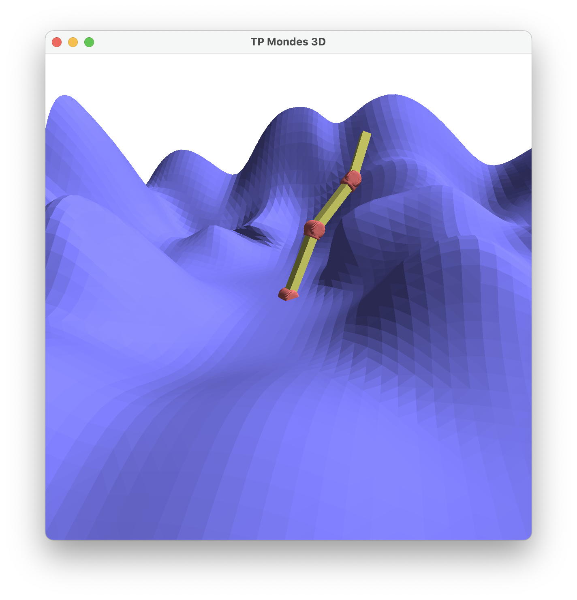

# Cinematic inverse et skinning. 

## Rendu du bras articulé. 

Il faut ici faire en sorte que chaque segment soit dessiné à partir de l'extrémité du segment précédent : 

```cpp
void Viewer::drawArticulatedArm() {
  Affine3f M;
  M.setIdentity();

  // facteur d'échelle uniforme pour tracer les joints
  float jointScale = 0.2f;

  int n = int(_lengths.size()); // number of segments
  for (int i = 0; i < n; ++i) {


    // Draw joint.
    M = M * AngleAxisf(_jointAngles(0, i), Vector3f::UnitZ());
    setObjectMatrix(_shader, (M * Scaling(jointScale)).matrix());
    glUniform3fv(_shader.getUniformLocation("color"), 1,
                 Vector3f(0.8f, 0.4f, 0.4f).data());
    _jointMesh.draw(_shader);

    // phi = joint angle 0
    // theta = joint angle 1
    M = M * AngleAxisf(_jointAngles(1, i), Vector3f::UnitY()); 

    // Draw segment.
    setObjectMatrix(_shader, (M * Scaling(1.f, 1.f, _lengths[i])).matrix());
    glUniform3fv(_shader.getUniformLocation("color"), 1,
                 Vector3f(0.8f, 0.8f, 0.4f).data());
    _segmentMesh.draw(_shader);

    // _length = segment length
    M = M * Translation3f(0, 0, _lengths[i]);
  }
}
```

Voici le résultat du code précédent : 

<p>
    
</P>


